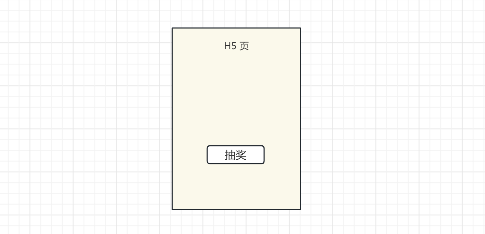

# 前端 Leader 面试

二面结束以后，前端团队 Leader 面试，不再关注技术细节，更关注项目组织和设计能力。

## 浏览器从输入 url 到显示网页的全过程

::: tip
这个问题在任何面试环节都有可能被考察，要提前准备。
:::

## 从 0 搭建一个前端项目，需要考虑哪些方面

参考答案

::: details

- 代码仓库，发布到哪个 npm 仓库（如有需要）
- 框架 Vue React
- 代码目录规范
- 打包构建 webpack 等，做打包优化
- eslint prettier commit-lint
- pre-commit
- 单元测试
- CI/CD 流程
- 开发环境，预发布环境
- 开发文档
- ...

:::

## 如何实现 ajax 并发请求控制？

## React 和 Vue 有什么区别？更擅长哪一个？

## 如何做好技术选型？

## 如何理解技术方案设计？是否做过技术方案设计？

## 线上出了严重 bug 你该如何解决？

## 你参与的项目，研发流程是怎样的？

瀑布？敏捷开发？kanban？

## 你如何保障代码质量？

## 是否写过单元测试和 e2e 测试？

## 使用 Vue/React 设计 TodoList

明确功能，设计数据结构和组件结构

## 使用 Vue/React 设计一个购物车

明确功能，设计数据结构和组件结构

## 使用 JS + HTML 设计 撤销/重做 undo/redo

## 设计一个前端统计 SDK

## 开发一个 H5 抽奖页，需要后端提供哪些接口

假如你刚接手一个抽奖 H5 运营页（微信朋友圈分享的），你应该和服务端确认哪些 API 接口？



参考答案

::: details

- 用户身份的验证方式
- 是否已经抽过（直接显示结果）
- 点击，触发抽奖
- 统计埋点（PV UV 自定义事件 性能 报错 分享行为等）

:::

## 自定义 DSL 流程图

请自定义 XML 来描述这个流程图


参考答案

::: details

```xml
<chart>
    <start-end id="start">开始</start-end>
    <flow id="flow1">流程1</flow>
    <judge id="judge1">评审</judge>
    <flow id="flow2">流程2</flow>
    <start-end id="end">结束</start-end>
    <arrow from="start" to="flow1"></arrow>
    <arrow from="flow1" to="judge1"></arrow>
    <arrow from="judge1" to="flow2">Y</arrow>
    <arrow from="judge1" to="end">N</arrow>
    <arrow from="flow2" to="end"></arrow>
</chart>
<!-- 另，每个节点还可以加上 x y 的定位信息，尺寸，边框、颜色等 -->
```

:::

## 最近在看什么书？或者学什么新技术吗？

## 你的缺点是什么？
